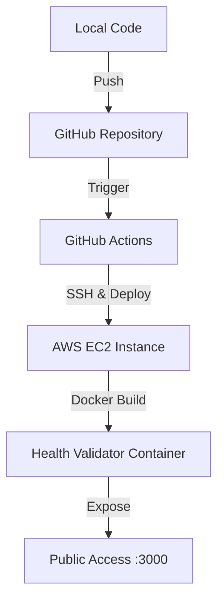

# 🏥 Health Validator: Full-Stack DevOps Pipeline

<div align="center">
  
  
  
  
  
  
</div>

---

## 🚀 Project Overview
This project demonstrates a complete **End-to-End CI/CD Pipeline** for a Node.js Health Validator application. It integrates containerization, automated testing, and cloud deployment to provide a robust DevOps workflow.

### ✨ Key Features
- **Health Monitoring**: Dedicated `/health` endpoint for system status.
- **Containerization**: Fully Dockerized environment for consistent deployment.
- **CI/CD Automation**: Automated build and deployment using GitHub Actions.
- **Cloud Infrastructure**: Hosted on AWS EC2 for high availability.

---

## 📈 My Learning Journey & Progress

I started this project as part of my Full-Stack & DevOps training. Here's the progress I've made so far:

### 🛠 Phase 1: Application Development
- Built a lightweight REST API using **Node.js** and **Express**.
- Implemented core routes including a status check and a health validator.

### 🐳 Phase 2: Dockerization
- Created a optimized `Dockerfile` using `node:18-alpine`.
- Managed dependencies and environment configurations within containers.
- Learned to use `.dockerignore` to keep images slim and secure.

### ☁️ Phase 3: Infrastructure (AWS EC2)
- Provisioned and configured an **AWS EC2** instance.
- Set up SSH access and security groups to allow traffic on port 3000.
- Installed Docker on the remote server to host the application.

### 🔄 Phase 4: CI/CD Pipeline
- **GitHub Actions**: Configured `deploy.yml` to automate the SSH-based deployment.
- **Jenkins Integration**: Explored Jenkins for alternative pipeline management.
- **Automation Flow**: Code Push → GitHub Action Trigger → SSH to EC2 → Docker Rebuild → Service Restart.

---

## 🏗 System Architecture



---

## 🚦 Getting Started

### Prerequisites
- [Node.js](https://nodejs.org/) (v18+)
- [Docker](https://www.docker.com/)

### Local Development
1. Clone the repository:
   ```bash
   git clone https://github.com/ShivangChaurasia/Health_Validator_Docker_CICD_Pipeline_Jenkins_EC2_GithubActions.git
   ```
2. Install dependencies:
   ```bash
   npm install
   ```
3. Run the app:
   ```bash
   npm start
   ```

### Running with Docker
```bash
docker build -t healthvalidator-app .
docker run -p 3000:3000 healthvalidator-app
```

---

## 📝 Roadmap & Future Enhancements
- [ ] Implement Unit Testing with Jest.
- [ ] Add Monitoring with Prometheus & Grafana.
- [ ] Set up a Load Balancer (ELB) for scaling.
- [ ] Integrate Kubernetes (K8s) for orchestration.

---

<div align="center">
  <sub>Built with ❤️ by <b>Shivang Chaurasia</b></sub>
</div>
